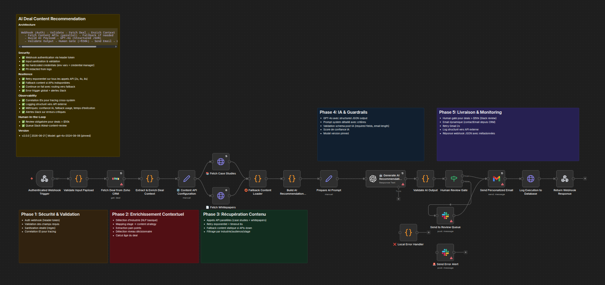

# AI Deal Content Recommendation

> Automatisation n8n qui recommande du contenu personnalisé (case studies, whitepapers) aux deals Zoho CRM en fonction de leur stage et secteur d'activité, via OpenAI GPT-4o.

## Architecture



## Fonctionnement

1. **Webhook Zoho CRM** — Déclenché lors d'un changement de stage (`Needs Analysis` ou `Proposal/Price Quote`)
2. **Extraction & Enrichissement** — Récupère les données du deal, contact, compte (industrie, taille)
3. **Récupération de contenu** — Fetch case studies et whitepapers depuis vos APIs CMS
4. **AI Recommendation** — OpenAI GPT-4o sélectionne et personnalise le contenu pertinent
5. **Email automation** — Envoie un email personnalisé au contact via Gmail
6. **Human Gate** — Les deals > 50k$ passent en revue Slack avant envoi
7. **Logging & Monitoring** — Trace chaque exécution avec métriques

## Stack

| Technologie | Rôle |
|---|---|
| **n8n** | Workflow engine & orchestration |
| **Zoho CRM** | Source des deals & contacts |
| **OpenAI GPT-4o** | Recommandation IA & génération email |
| **Gmail API** | Envoi d'emails |
| **Slack** | Alertes & human review |
| **Docker** | Déploiement de n8n |

## Démarrage rapide

```bash
# 1. Cloner le repo
git clone <url>
cd AI-Deal-content-Recommandation

# 2. Configurer l'environnement
cp .env.example .env
# Éditer .env avec vos credentials

# 3. Lancer n8n
docker compose up -d

# 4. Importer le workflow
# → n8n UI > Workflows > Add > Import from File > workflow/AI-deal-content-recommendation.json

# 5. Configurer les credentials n8n
# Voir DEPLOYMENT_GUIDE.md pour la configuration détaillée
```

## Variables d'environnement

| Variable | Description |
|---|---|
| `N8N_BASIC_AUTH_USER` | Utilisateur n8n Basic Auth |
| `N8N_BASIC_AUTH_PASSWORD` | Mot de passe n8n Basic Auth |
| `CASE_STUDIES_API_URL` | API endpoint des case studies |
| `WHITEPAPERS_API_URL` | API endpoint des whitepapers |
| `FALLBACK_CONTENT_URL` | API de fallback si les APIs sont down |
| `LOG_API_URL` | Endpoint de logging |
| `ERROR_LOG_API_URL` | Endpoint d'error logging |
| `ALERT_EMAIL` | Email pour les alertes ops |
| `NODE_ENV` | Environnement (production, development) |

## Déploiement

Voir [DEPLOYMENT_GUIDE.md](DEPLOYMENT_GUIDE.md) pour la configuration complète :
- Credentials Zoho CRM, OpenAI, Gmail, Slack
- Workflow rule Zoho (webhook trigger)
- Prompt tuning & coûts OpenAI
- Monitoring & alertes
- Troubleshooting
